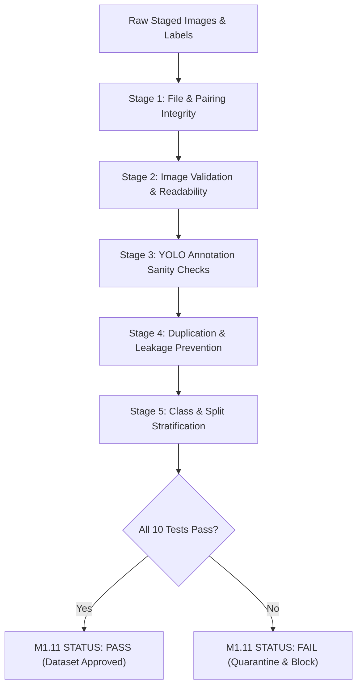

# CVKI M1.10 — Quality Control Plan

- **Project**: Civic Vision & Knowledge Intelligence (CVKI)
- **Module**: M1.10 — Waterlogging Dataset Improvement & Preparation
- **Document**: Quality Control & Automated QA Audit Plan
- **Status**: **REVIEW / PROPOSAL** (Planning only)
- **Date**: 2026-09-12

---

## 1. Quality Control Architecture Overview

Before any improved dataset can be utilized for experimental YOLOv8 training, it must pass a comprehensive, automated, multi-tiered Quality Assurance (QA) suite. 

The QA suite will be implemented as a standalone script:
`ai/computer_vision/waterlogging_improvement_review/verify_improved_qc.py`
and executed in strictly read-only mode, generating an auditable QA report and machine-readable summary JSON.



---

## 2. The 10 Automated QA Modules

| Check ID | Module Name | Method & Target | Failure Threshold | Action on Failure |
|---|---|---|---|---|
| **QC-01** | **Directory & Structure Parity** | Verifies standard YOLO subdirectories (`images/train`, `val`, `test`; `labels/train`, `val`, `test`). | Any missing or extra directory | BLOCK |
| **QC-02** | **1:1 Image-Label Pairing** | Verifies each `.jpg` image has an identically named `.txt` label file in the same split. | $>0$ orphan images or $>0$ orphan labels | BLOCK |
| **QC-03** | **Image File Integrity** | Validates all images using PIL `verify()` and full RGB pixel decoding. | $>0$ corrupt or unreadable files | BLOCK |
| **QC-04** | **YOLO Coordinate Bounds** | Verifies every annotation row has exactly 5 tokens, class $\in \{0, 1, 2\}$, and $0.0 \le x, y, w, h \le 1.0$. | $>0$ malformed rows or coordinates out of bounds | BLOCK |
| **QC-05** | **Minimum Area & Aspect Ratio Sanity** | Detects degenerate micro-boxes ($area < 0.005$) and extreme aspect ratios ($AR < 0.25$ or $> 4.0$). | $>0$ unverified micro-boxes | BLOCK |
| **QC-06** | **Exact Duplicate Detection** | Computes SHA-256 hashes across all image files to detect byte-level duplication. | $>0$ SHA-256 collisions across images | BLOCK |
| **QC-07** | **Perceptual Near-Duplicate Detection** | Computes difference hash (dHash, 64-bit) across all images. | Any image pair with Hamming distance $\le 3$ | REVIEW / BLOCK |
| **QC-08** | **Scene Leakage Prevention** | Extracts base scene stem (e.g. `waterloggingt-103`) and verifies all scene variants are confined to a single split. | Any base scene appearing in multiple splits | BLOCK |
| **QC-09** | **Negative Sample Label Integrity** | Verifies that all designated background negative images have exactly 0-byte, 0-row label files. | Any negative image with bounding boxes | BLOCK |
| **QC-10** | **Baseline Immutability Check** | Verifies SHA-256 checksums of frozen M1.8 dataset, `best.pt`, `last.pt`, and `results.csv`. | Any hash mismatch against M1.8 manifest | IMMEDIATE ABORT |

---

## 3. Detailed Specification for Critical Checks

### 3.1 Check QC-04: YOLO Coordinate Validation
Every line in every `.txt` file must parse strictly under:
```python
def validate_yolo_row(row_str, filename):
    parts = row_str.strip().split()
    assert len(parts) == 5, f"Malformed token count in {filename}: {row_str}"
    cls_id = int(parts[0])
    xc, yc, w, h = [float(x) for x in parts[1:]]
    assert cls_id in [0, 1, 2], f"Invalid class ID {cls_id} in {filename}"
    assert 0.0 <= xc <= 1.0 and 0.0 <= yc <= 1.0, f"Center out of bounds in {filename}"
    assert 0.0 < w <= 1.0 and 0.0 < h <= 1.0, f"Dimension out of bounds in {filename}"
    assert (xc - w/2) >= -1e-6 and (xc + w/2) <= 1.0 + 1e-6, f"BBox boundary out of bounds in {filename}"
    assert (yc - h/2) >= -1e-6 and (yc + h/2) <= 1.0 + 1e-6, f"BBox boundary out of bounds in {filename}"
```

### 3.2 Check QC-05: Waterlogging Annotation Sanity Rules
For the `road_waterlogging` class (Class 2):
1. **Area Check**: Box area $(w \times h)$ must be $\ge 0.005$ (at least 0.5% of total image canvas).
2. **Aspect Ratio Check**: Aspect ratio $(w / h)$ must satisfy $0.25 \le AR \le 4.0$. Any box violating this ratio is flagged for manual review as a potential vertical rotation artifact.
3. **Contiguous Overlap Check**: In any single image, no two waterlogging bounding boxes may have an Intersection-over-Union (IoU) $> 0.20$ or an Intersection-over-Area (IoA) $> 0.40$. Overlapping boxes must be merged into a single contiguous flood hazard box.

### 3.3 Check QC-08: Cross-Split Scene Leakage Rule
To prevent data contamination between train, validation, and test splits:
```python
def check_scene_leakage(manifest):
    scene_splits = defaultdict(set)
    for item in manifest["images"]:
        scene_splits[item["scene_group"]].add(item["split"])
    
    leakage = {scene: splits for scene, splits in scene_splits.items() if len(splits) > 1}
    assert len(leakage) == 0, f"Cross-split scene leakage detected in: {leakage}"
```

### 3.4 Check QC-10: Baseline Immutability Rule
To guarantee the frozen M1.8 baseline is never modified:
```python
M1_8_BASELINE_HASHES = {
    "best_pt": "sha256_of_m1_8_best_pt",
    "last_pt": "sha256_of_m1_8_last_pt",
    "results_csv": "sha256_of_m1_8_results_csv",
    "dataset_manifest": "sha256_of_m1_8_dataset_manifest"
}
```
If any of these files differ by even 1 byte, the execution halts immediately.

---

## 4. Quality Control Deliverables & Acceptance Threshold

Execution of the QC plan will generate two auditable artifacts:
1. `ai/computer_vision/waterlogging_improvement_review/qc_report.md`: Full human-readable markdown breakdown of all 10 checks.
2. `ai/computer_vision/waterlogging_improvement_review/qc_summary.json`: Machine-readable audit status containing per-check pass/fail booleans, timestamps, and hash signatures.

**Acceptance Threshold**:
- **100% Pass Rate**: All 10 modules must return status `PASS`.
- **Zero Warnings Unresolved**: Any flagged items must be documented in `qc_report.md` with explicit justification before dataset freezing.
